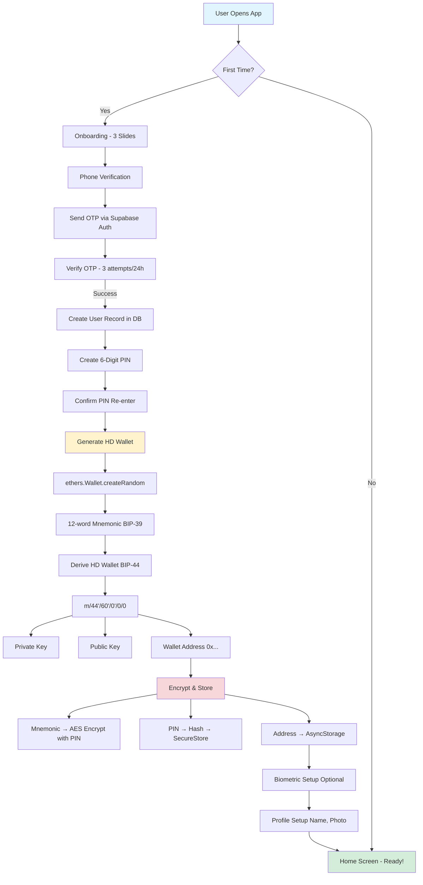
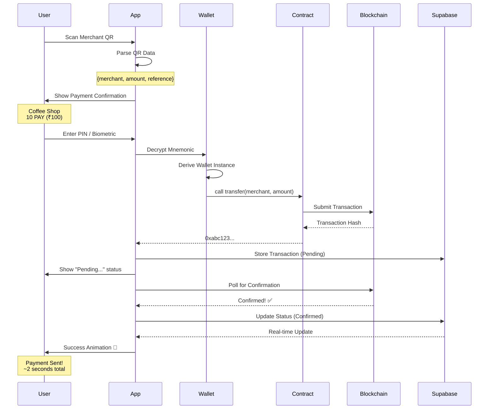
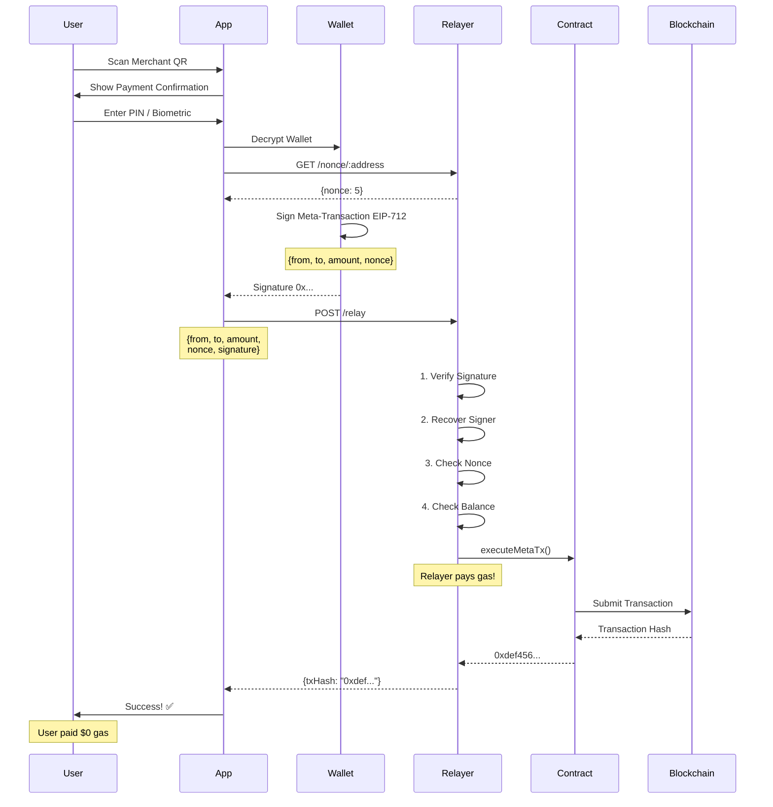

<div align="center">

# ⚡ C-Pay

### UPI for Web3 - Making Blockchain Payments Simple

[](https://reactnative.dev/)
[](https://expo.dev/)
[](https://soliditylang.org/)
[](https://polygon.technology/)
[](https://www.typescriptlang.org/)
[](LICENSE)

**Making blockchain payments as simple as scanning a QR code**  
_No crypto knowledge required_

[Download APK](#-download-apk) • [Quick Start](#-quick-start) • [Roadmap](#-roadmap)

</div>

---

## 📋 Table of Contents

<details>
<summary>Click to expand</summary>

- [Overview](#-overview)
- [Download APK](#-download-apk)
- [Vision](#-vision)
- [Key Features](#-key-features)
- [Architecture](#-architecture)
  - [System Overview](#system-overview)
  - [Component Architecture](#component-architecture)
  - [Data Flow](#data-flow)
  - [Database Schema](#database-schema)
- [Project Structure](#-project-structure)
- [Quick Start](#-quick-start)
- [Components](#-components)
- [Tech Stack](#-tech-stack)
- [How It Works](#-how-it-works)
- [Cost Breakdown](#-cost-breakdown)
- [Security](#-security)
- [Roadmap](#-roadmap)
- [Contributing](#-contributing)

</details>

---

## 🎯 Overview

**C-Pay** transforms blockchain payments into a UPI-like experience. Users don't need to understand wallets, gas fees, or private keys — just scan a QR code, authenticate with PIN or biometrics, and pay instantly.

### Why C-Pay?

<table>
<tr>
<th>Traditional Crypto Wallets</th>
<th>C-Pay</th>
</tr>
<tr>
<td>

❌ 12-24 word seed phrases  
❌ Manual gas fee management  
❌ Complex wallet addresses  
❌ Separate merchant solutions  
❌ Technical onboarding

</td>
<td>

✅ 6-digit PIN  
✅ Invisible to users (optional gasless)  
✅ QR codes + phone numbers  
✅ Built-in merchant mode  
✅ UPI-like simplicity

</td>
</tr>
</table>

### 📊 Quick Stats

```
💰 Budget: $0           ⏱️  Timeline: 6 weeks
📱 Screens: 22          🧪 Tests: 25+
⭐ Features: 30+        🔐 Security: Enterprise-grade
```

---

## 📱 Download APK

<div align="center">

### Ready to try C-Pay?

[](https://expo.dev/accounts/soumen0818/projects/cryptopay/builds/cd12dd8d-2765-4911-9d45-a7a6f5566d8d)

> **Note:** This is a testnet version running on Polygon Amoy. Use test tokens only.

</div>

---

## 💡 Vision

### Make Blockchain Payments Invisible

Users shouldn't need to know they're using blockchain technology. Just like they don't think about HTTP when browsing the web, they shouldn't think about gas fees, nonces, or private keys when making payments.

### The UPI Analogy

Just as UPI revolutionized digital payments in India by abstracting banking complexity, C-Pay abstracts blockchain complexity:

<table>
<tr>
<th>Banking Abstraction (UPI)</th>
<th>Blockchain Abstraction (C-Pay)</th>
</tr>
<tr>
<td>

🏦 Bank accounts → VPA  
🔐 Net banking → PIN/Biometric  
📋 Account numbers → QR codes  
⏰ NEFT delays → Instant settlement  
🏪 Separate POS → Unified app

</td>
<td>

🔑 Private keys → 6-digit PIN  
📝 Mnemonics → Biometric unlock  
📍 Addresses → QR codes  
⛽ Gas fees → Invisible/Gasless  
🏪 Separate wallet → Merchant mode

</td>
</tr>
</table>

---

## ✨ Key Features

### 👤 User Features

<details open>
<summary><b>Authentication & Security</b></summary>

- 📱 **Phone Verification** - OTP-based authentication with rate limiting (3 attempts/24h)
- 🔐 **6-Digit PIN** - Simple, secure access (replaces complex mnemonics)
- 👆 **Biometric Auth** - Face ID / Touch ID unlock
- 🔑 **HD Wallet** - BIP-39/44 compliant wallet generation (invisible to user)
- 🛡️ **Encrypted Storage** - Private keys never leave device (SecureStore)

</details>

<details open>
<summary><b>Payments</b></summary>

- 📸 **QR Code Scanning** - Scan merchant QR to pay instantly
- 💸 **Instant Transfers** - ~2 second settlement on Polygon
- 📊 **Transaction History** - Complete payment log with real-time updates
- 💰 **Balance Display** - PAY token balance with INR equivalent
- 🎁 **Testnet Faucet** - Claim 100 PAY tokens for testing (24h cooldown)
- 🔄 **Send Money** - Direct transfers to wallet addresses or C-Pay IDs
- 🆔 **C-Pay ID System** - User-friendly payment IDs (e.g., 9876543210@cpay1a2b)

</details>

<details open>
<summary><b>User Experience</b></summary>

- 🎨 **Modern UI** - Clean, intuitive design with smooth animations
- 🌙 **Profile Management** - Customizable name and profile photo
- 🔄 **Change PIN** - Secure 3-step PIN update flow
- 🚪 **Session Management** - Sign out without losing wallet
- 🔓 **PIN Recovery** - Biometric + OTP verification flow
- 📴 **Offline-First** - Works without constant connectivity

</details>

### 🏪 Merchant Features

<details>
<summary><b>Click to expand merchant features</b></summary>

- 🏪 **Merchant Registration** - Business name, category, location
- 📊 **Merchant Dashboard** - Sales analytics and payment insights
- 📱 **Global QR Code** - Reusable QR code for your business
- 💵 **Dynamic Pricing** - Generate QR codes with specific amounts
- 📈 **Transaction Tracking** - Real-time payment monitoring
- 🔔 **Payment Notifications** - Instant alerts for received payments
- 📋 **Payment History** - Detailed merchant transaction log

</details>

### 🌐 Platform Features

- 🚀 **Gasless Transactions** (Optional) - Meta-transactions via relayer service
- ⚡ **Fast Settlement** - 2-second confirmation on Polygon Amoy
- 🌐 **Real-time Sync** - Supabase for instant updates
- 🔒 **Rate Limiting** - Anti-spam protection (100 req/min on relayer)
- 📧 **Email Alerts** - Low balance notifications for relayer
- 🩺 **Health Monitoring** - Service uptime tracking with /health endpoint
- 🆔 **C-Pay ID System** - User-friendly payment identifiers stored in database
- 🔐 **Production Ready** - 0 vulnerabilities, enterprise-grade security

---

## 🏗️ Architecture

### System Overview

```
┌─────────────────────────────────────────────────────────────────┐
│                      C-PAY ECOSYSTEM                            │
└─────────────────────────────────────────────────────────────────┘

┌─────────────────┐         ┌─────────────────┐         ┌──────────────────┐
│   Mobile App    │◄───────►│ Relayer Service │◄───────►│   Blockchain     │
│ (React Native)  │  HTTPS  │   (Node.js)     │   RPC   │   (Polygon)      │
│                 │         │                 │         │                  │
│  ┌───────────┐  │         │  ┌───────────┐  │         │  ┌────────────┐  │
│  │  Wallet   │  │         │  │Meta-Tx    │  │         │  │ PayToken   │  │
│  │  Service  │  │         │  │Executor   │  │         │  │ (ERC-20)   │  │
│  └───────────┘  │         │  └───────────┘  │         │  └────────────┘  │
│                 │         │                 │         │                  │
│  ┌───────────┐  │         │  ┌───────────┐  │         │  ┌────────────┐  │
│  │   Auth    │  │         │  │Signature  │  │         │  │   Faucet   │  │
│  │  Service  │  │         │  │ Verify    │  │         │  │  Function  │  │
│  └───────────┘  │         │  └───────────┘  │         │  └────────────┘  │
└────────┬────────┘         └─────────────────┘         └──────────────────┘
         │                                                        │
         │                  ┌─────────────────┐                 │
         └─────────────────►│    Supabase     │◄────────────────┘
                   HTTPS    │   PostgreSQL    │    Webhooks
                            │   + Storage     │
                            │   + Real-time   │
                            └─────────────────┘

Legend:
────►  Direct Communication
◄────  Response/Callback
```

### Data Flow

#### 1️⃣ Wallet Creation Flow



#### 2️⃣ Payment Flow - Standard (Path A)



#### 3️⃣ Payment Flow - Gasless (Path B)



### Database Schema

```sql
-- ═══════════════════════════════════════════════════════════════
-- USERS TABLE
-- ═══════════════════════════════════════════════════════════════
CREATE TABLE users (
  id                UUID PRIMARY KEY DEFAULT uuid_generate_v4(),
  phone_number      TEXT UNIQUE NOT NULL,
  wallet_address    TEXT UNIQUE NOT NULL,
  cpay_id           TEXT UNIQUE,  -- User-friendly ID: 9876543210@cpay1a2b
  name              TEXT,
  profile_photo_url TEXT,
  is_merchant       BOOLEAN DEFAULT FALSE,
  created_at        TIMESTAMP DEFAULT NOW(),
  updated_at        TIMESTAMP DEFAULT NOW()
);

CREATE INDEX idx_users_wallet ON users(wallet_address);
CREATE INDEX idx_users_phone ON users(phone_number);
CREATE INDEX idx_users_cpay_id ON users(cpay_id);

-- ═══════════════════════════════════════════════════════════════
-- MERCHANTS TABLE
-- ═══════════════════════════════════════════════════════════════
CREATE TABLE merchants (
  id                 UUID PRIMARY KEY DEFAULT uuid_generate_v4(),
  user_id            UUID REFERENCES users(id) ON DELETE CASCADE,
  business_name      TEXT NOT NULL,
  business_category  TEXT,
  location           TEXT,
  merchant_address   TEXT UNIQUE NOT NULL,
  cpay_id            TEXT UNIQUE,  -- Merchant C-Pay ID
  phone_number       TEXT,
  total_sales        NUMERIC DEFAULT 0,
  transaction_count  INTEGER DEFAULT 0,
  created_at         TIMESTAMP DEFAULT NOW()
);

CREATE INDEX idx_merchants_user ON merchants(user_id);
CREATE INDEX idx_merchants_address ON merchants(merchant_address);
CREATE INDEX idx_merchants_cpay_id ON merchants(cpay_id);

-- ═══════════════════════════════════════════════════════════════
-- TRANSACTIONS TABLE
-- ═══════════════════════════════════════════════════════════════
CREATE TABLE transactions (
  id             UUID PRIMARY KEY DEFAULT uuid_generate_v4(),
  from_address   TEXT NOT NULL,
  to_address     TEXT NOT NULL,
  amount         NUMERIC NOT NULL,
  tx_hash        TEXT UNIQUE NOT NULL,
  status         TEXT NOT NULL,  -- 'pending' | 'confirmed' | 'failed'
  type           TEXT NOT NULL,  -- 'send' | 'receive' | 'merchant_payment'
  block_number   BIGINT,
  gas_used       TEXT,
  merchant_name  TEXT,
  note           TEXT,
  created_at     TIMESTAMP DEFAULT NOW(),
  confirmed_at   TIMESTAMP
);

CREATE INDEX idx_tx_from ON transactions(from_address);
CREATE INDEX idx_tx_to ON transactions(to_address);
CREATE INDEX idx_tx_hash ON transactions(tx_hash);
CREATE INDEX idx_tx_status ON transactions(status);
CREATE INDEX idx_tx_created ON transactions(created_at DESC);

-- ═══════════════════════════════════════════════════════════════
-- OTP RATE LIMITING TABLE
-- ═══════════════════════════════════════════════════════════════
CREATE TABLE otp_attempts (
  id               UUID PRIMARY KEY DEFAULT uuid_generate_v4(),
  phone_number     TEXT NOT NULL,
  attempt_count    INTEGER DEFAULT 1,
  first_attempt_at TIMESTAMP DEFAULT NOW(),
  last_attempt_at  TIMESTAMP DEFAULT NOW()
);

CREATE INDEX idx_otp_phone ON otp_attempts(phone_number);
```

---

## 📁 Project Structure

```
C-Pay/
│
├── 📱 App/                          React Native Mobile Application
│   ├── src/
│   │   ├── screens/                 22 UI Screens
│   │   │   ├── auth/                Authentication Flow
│   │   │   ├── main/                Main App Screens
│   │   │   └── merchant/            Merchant Features
│   │   ├── components/              Reusable UI Components
│   │   │   ├── QRScanner.tsx
│   │   │   ├── QRDisplay.tsx
│   │   │   └── TransactionCard.tsx
│   │   ├── services/                Business Logic Layer
│   │   │   ├── walletService.ts     HD Wallet + Encryption
│   │   │   ├── authService.ts       Authentication Logic
│   │   │   ├── blockchainService.ts ethers.js Integration
│   │   │   ├── supabaseService.ts   Database Operations
│   │   │   ├── merchantService.ts   Merchant Features
│   │   │   └── relayerService.ts    Meta-Transaction Handler
│   │   ├── utils/                   Helper Functions
│   │   ├── types/                   TypeScript Definitions
│   │   ├── constants/               Configuration & Constants
│   │   └── navigation/              Navigation Setup
│   ├── assets/                      Static Assets (Images, Fonts)
│   ├── docs/                        📚 15+ Documentation Files
│   ├── Database-schema/             SQL Migration Scripts
│   ├── App.tsx                      Application Entry Point
│   └── README.md                    App Documentation
│
├── ⛓️  Blockchain/                   Smart Contracts
│   ├── contracts/
│   │   └── PayToken.sol             ERC-20 + Meta-Transactions
│   ├── scripts/
│   │   └── deploy.js                Deployment Script
│   ├── test/
│   │   └── PayToken.test.js         25+ Contract Tests
│   ├── hardhat.config.js            Hardhat Configuration
│   └── README.md                    Blockchain Documentation
│
├── 🔄 relayer-service/               Backend Service (Optional)
│   ├── server.js                    Express.js API Server
│   ├── package.json                 Dependencies
│   └── README.md                    Relayer Documentation
│
└── 📄 README.md                      👈 You Are Here
```

---

## 🚀 Quick Start

### Prerequisites

```bash
# Required
✅ Node.js >= 18.0.0
✅ npm >= 9.0.0
✅ Expo Go app on mobile device
✅ Supabase account (free tier)
✅ MetaMask or wallet (for deployment)
```

### Installation

#### 1. Clone Repository

```bash
git clone https://github.com/yourusername/C-Pay.git
cd C-Pay
```

#### 2. Setup Mobile App

```bash
cd App
npm install

# Create environment file
cp .env.example .env
```

Edit `App/.env`:

```env
EXPO_PUBLIC_SUPABASE_URL=https://your-project.supabase.co
EXPO_PUBLIC_SUPABASE_ANON_KEY=your-anon-key
EXPO_PUBLIC_TOKEN_ADDRESS=0xYourTokenAddress
EXPO_PUBLIC_RPC_URL=https://rpc-amoy.polygon.technology
EXPO_PUBLIC_CHAIN_ID=80002
EXPO_PUBLIC_RELAYER_URL=https://your-relayer-service.com
```

**Important:** Run C-Pay ID migration in Supabase SQL Editor:

```sql
-- Run Database-schema/ADD_CPAY_ID_MIGRATION.sql
-- This adds cpay_id column to users and merchants tables
-- Format: 10digitPhone@cpay+last4wallet (e.g., 9876543210@cpay1a2b)
```

#### 3. Deploy Smart Contract

```bash
cd ../Blockchain
npm install

# Create environment file
cp .env.example .env
```

Edit `Blockchain/.env`:

```env
PRIVATE_KEY=your_wallet_private_key
AMOY_RPC_URL=https://rpc-amoy.polygon.technology
RELAYER_ADDRESS=0xYourRelayerAddress
```

Get test MATIC:

- 🚰 [Polygon Faucet](https://faucet.polygon.technology/)

Deploy contract:

```bash
npx hardhat run scripts/deploy.js --network amoy
```

Copy the deployed token address to `App/.env`.

#### 4. (Optional) Setup Relayer Service

```bash
cd ../relayer-service
npm install
cp .env.example .env
```

Edit `.env`, fund relayer wallet, then:

```bash
npm start
```

Update `App/.env` with relayer URL.

#### 5. Run Mobile App

```bash
cd ../App
npm start
```

📱 **Scan QR code with Expo Go app!**

---

## 🧩 Components

### 📱 Mobile App (`App/`)

<table>
<tr>
<td width="50%">

**Purpose**  
Cross-platform mobile application for iOS and Android

**Key Features**

- User authentication (OTP, PIN, biometrics)
- Wallet creation and management
- QR code scanning and generation
- Payment processing
- Transaction history
- Merchant mode

</td>
<td width="50%">

**Technologies**

- React Native 0.81
- Expo ~54.0
- TypeScript 5.9
- Ethers.js v6.16
- React Navigation v7
- Supabase Client

📖 [**Detailed Documentation →**](App/README.md)

</td>
</tr>
</table>

---

### ⛓️ Smart Contracts (`Blockchain/`)

<table>
<tr>
<td width="50%">

**Purpose**  
On-chain logic for token transfers and meta-transactions

**Key Contract: PayToken**  
ERC-20 Token with EIP-2771 support

**Features**

- Standard ERC-20 functionality
- Faucet (100 PAY / 24h)
- Meta-transaction support
- Nonce management
- Relayer authorization

</td>
<td width="50%">

**Technologies**

- Solidity 0.8.20
- Hardhat
- OpenZeppelin Contracts
- Ethers.js v6

**Network**  
Polygon Amoy Testnet  
Chain ID: 80002

📖 [**Detailed Documentation →**](Blockchain/README.md)

</td>
</tr>
</table>

---

### 🔄 Relayer Service (`relayer-service/`)

<table>
<tr>
<td width="50%">

**Purpose**  
Backend service for gasless transactions _(Optional - Path B)_

**Key Features**

- Accept signed meta-transactions
- Verify signatures (EIP-712)
- Submit transactions to blockchain
- Pay gas fees on behalf of users
- Monitor service health

</td>
<td width="50%">

**Technologies**

- Node.js 18+
- Express.js
- Ethers.js v6
- Helmet.js (Security)

**Endpoints**

- `POST /relay` - Submit meta-tx
- `GET /nonce/:address` - Get nonce
- `GET /health` - Service status

📖 [**Detailed Documentation →**](relayer-service/README.md)

</td>
</tr>
</table>

---

## 🛠 Tech Stack

### Frontend Stack

| Technology                                                                                                        | Version | Purpose                            |
| ----------------------------------------------------------------------------------------------------------------- | ------- | ---------------------------------- |
|  | 0.81    | Cross-platform mobile framework    |
|                     | ~54.0   | Build tooling and managed workflow |
|   | ~5.9    | Type safety and DX                 |
|       | v6.16   | Blockchain interactions            |
| React Navigation                                                                                                  | v7      | Stack and tab navigation           |
| Supabase Client                                                                                                   | v2.89   | Database and real-time             |
| Expo SecureStore                                                                                                  | Latest  | Encrypted key storage              |
| Expo Local Auth                                                                                                   | Latest  | Biometric authentication           |
| Expo Camera                                                                                                       | Latest  | QR code scanning                   |
| React Native SVG                                                                                                  | Latest  | QR code generation                 |

### Backend Stack

| Service                                                                                                    | Purpose                           | Cost          |
| ---------------------------------------------------------------------------------------------------------- | --------------------------------- | ------------- |
|  | PostgreSQL DB, Real-time, Storage | Free - $25/mo |
|     | Relayer Service API               | $0 - $10/mo   |
|     | REST API Framework                | Free          |

### Blockchain Stack

| Technology                                                                                                             | Purpose                           |
| ---------------------------------------------------------------------------------------------------------------------- | --------------------------------- |
|              | Smart contract language (0.8.20)  |
|                 | Development environment & testing |
|  | Secure contract libraries         |
|                 | Layer 2 testnet (Amoy)            |
|            | Blockchain library (v6)           |

---

## ⚙️ How It Works

### 👤 User Journey: First-Time User

```
┌─────────────────────────────────────────────────────────────┐
│                  ONBOARDING FLOW                            │
└─────────────────────────────────────────────────────────────┘

1️⃣  Download App
     ↓
2️⃣  Phone Verification (OTP)
     ↓
3️⃣  Create 6-Digit PIN
     ↓
4️⃣  ✨ Wallet Created (Invisible to user)
     ↓
5️⃣  Enable Biometrics (Optional)
     ↓
6️⃣  Setup Profile (Name, Photo)
     ↓
7️⃣  Claim Faucet (100 PAY tokens)
     ↓
8️⃣  🎉 Ready to Pay!

⏱️  Total time: ~2 minutes
```

### 💸 User Journey: Making a Payment

```
┌─────────────────────────────────────────────────────────────┐
│                  PAYMENT FLOW                               │
└─────────────────────────────────────────────────────────────┘

1️⃣  Tap "Scan & Pay"
     ↓
2️⃣  Scan Merchant QR Code
     ↓
3️⃣  Review Payment Details
     ┌────────────────────────┐
     │ Merchant: Coffee Shop  │
     │ Amount: 10 PAY (₹100)  │
     │ Your Balance: 50 PAY   │
     └────────────────────────┘
     ↓
4️⃣  Enter PIN or Use Face ID
     ↓
5️⃣  [Background] Sign Transaction
     ↓
6️⃣  [Background] Submit to Blockchain
     ↓
7️⃣  Success! Payment Sent ✅

⏱️  Total time: ~2 seconds
```

### 🏪 Merchant Journey

```
┌─────────────────────────────────────────────────────────────┐
│                  MERCHANT FLOW                              │
└─────────────────────────────────────────────────────────────┘

1️⃣  Enable Merchant Mode
     ↓
2️⃣  Register Business
     • Name, Category, Location
     ↓
3️⃣  Generate Global QR Code
     ↓
4️⃣  Display QR at Store
     ↓
5️⃣  Customer Scans & Pays
     ↓
6️⃣  Instant Notification 🔔
     ↓
7️⃣  View in Dashboard 📊

⏱️  Setup time: ~1 minute
```

---

## 💰 Cost Breakdown

### 🧪 MVP Development (Current)

<table>
<tr>
<th>Component</th>
<th>Cost</th>
<th>Notes</th>
</tr>
<tr>
<td>Development</td>
<td><code>$0</code></td>
<td>Self-developed</td>
</tr>
<tr>
<td>Supabase</td>
<td><code>$0</code></td>
<td>Free tier (500MB DB, 1GB storage)</td>
</tr>
<tr>
<td>Polygon Amoy</td>
<td><code>$0</code></td>
<td>Testnet (no real costs)</td>
</tr>
<tr>
<td>Expo Development</td>
<td><code>$0</code></td>
<td>Free tier</td>
</tr>
<tr>
<td>GitHub</td>
<td><code>$0</code></td>
<td>Public repository</td>
</tr>
<tr>
<td><strong>Total</strong></td>
<td><strong>$0/month</strong></td>
<td>✅ Completely free!</td>
</tr>
</table>

### 🚀 Production Deployment (Estimated)

<table>
<tr>
<th>Component</th>
<th>Monthly Cost</th>
<th>Notes</th>
</tr>
<tr>
<td>Supabase Pro</td>
<td><code>$25</code></td>
<td>Better performance, more storage</td>
</tr>
<tr>
<td>Relayer Service</td>
<td><code>$5-10</code></td>
<td>Render/Railway or VPS</td>
</tr>
<tr>
<td>Domain</td>
<td><code>$1</code></td>
<td>$12/year amortized</td>
</tr>
<tr>
<td>Expo EAS</td>
<td><code>$29</code></td>
<td>Production builds, OTA updates</td>
</tr>
<tr>
<td>SMS Gateway</td>
<td><code>Variable</code></td>
<td>$0.01-0.05 per SMS (Twilio/AWS SNS)</td>
</tr>
<tr>
<td>Gas Fees (Relayer)</td>
<td><code>Variable</code></td>
<td>~$0.01 per transaction on mainnet</td>
</tr>
<tr>
<td>Polygon RPC</td>
<td><code>$0-49</code></td>
<td>Alchemy/Infura (free tier available)</td>
</tr>
<tr>
<td><strong>Total</strong></td>
<td><strong>~$60-75</strong></td>
<td>+ variable gas costs</td>
</tr>
</table>

### 💸 Cost Per Transaction

| Scenario              | User Cost     | Platform Cost | Who Pays Gas?     |
| --------------------- | ------------- | ------------- | ----------------- |
| **Standard (Path A)** | ~$0.001 MATIC | $0            | User (negligible) |
| **Gasless (Path B)**  | $0            | ~$0.01        | Platform          |

---

## 🔒 Security

### 🔐 Wallet Security

<table>
<tr>
<td width="50%">

**Key Generation**

- ✅ HD Wallet (BIP-39/44 compliant)
- ✅ Industry-standard cryptography
- ✅ Secure random number generation

**Storage**

- ✅ AES-256 encryption
- ✅ OS-level SecureStore
  - iOS: Keychain
  - Android: Keystore
- ✅ PIN-protected decryption

</td>
<td width="50%">

**Access Control**

- ✅ 6-digit PIN required
- ✅ Biometric authentication
  - Face ID (iOS)
  - Touch ID (iOS)
  - Fingerprint (Android)
- ✅ Device credential fallback

**Privacy**

- ✅ Private keys never leave device
- ✅ Never shown to user
- ✅ Never transmitted over network

</td>
</tr>
</table>

### 🛡️ Authentication Security

- **Rate Limiting:** 3 OTP attempts per 24 hours per phone
- **Session Management:** Secure token-based authentication
- **PIN Hashing:** One-way bcrypt hash (cannot reverse-engineer)
- **Biometric Fallback:** Device credential required if biometrics unavailable
- **OTP Expiry:** Time-limited verification codes

### 🌐 Network Security

- **HTTPS Only:** All API calls encrypted in transit
- **CORS Protection:** Relayer service restricts origins
- **Rate Limiting:** 100 requests/minute per endpoint
- **Helmet.js:** Security headers (XSS, clickjacking, MIME-sniffing protection)
- **Input Validation:** All inputs sanitized and validated
- **SQL Injection Protection:** Parameterized queries only

### 📜 Smart Contract Security

- **OpenZeppelin Libraries:** Battle-tested, audited code
- **Access Control:** Owner-only functions for sensitive operations
- **Nonce System:** Prevents replay attacks
- **Signature Verification:** Cryptographic proof of authorization
- **Comprehensive Testing:** 25+ test cases covering edge cases
- **Gas Optimization:** Efficient code patterns

---

## 🛣 Roadmap

### ✅ Phase 1: MVP (Completed - January 2026)

<details open>
<summary><b>Goal: Functional testnet application with core features</b></summary>

<br>

**Authentication & Wallet**

- [x] Phone OTP authentication with rate limiting
- [x] 6-digit PIN creation and management
- [x] Biometric authentication (Face ID / Touch ID)
- [x] HD wallet generation (BIP-39/44)
- [x] Encrypted key storage (SecureStore)
- [x] PIN change flow
- [x] PIN recovery flow

**Payments**

- [x] QR code scanning for payments
- [x] Transaction history with real-time updates
- [x] Balance display (PAY tokens + INR equivalent)
- [x] Send money to wallet addresses or C-Pay IDs
- [x] C-Pay ID system (user-friendly payment identifiers)
- [x] Testnet faucet integration (100 PAY / 24h)
- [x] Transaction search and filtering

**Merchant Features**

- [x] Merchant registration
- [x] Merchant dashboard with analytics
- [x] Global QR code generation
- [x] Dynamic amount QR codes
- [x] Transaction tracking

**Backend & Infrastructure**

- [x] Supabase integration (DB + Real-time + Storage)
- [x] Smart contract deployment (Polygon Amoy)
- [x] Gasless transaction support (Relayer service)
- [x] C-Pay ID database schema and migration
- [x] Security audit (0 vulnerabilities)
- [x] Rate limiting and email alerts
- [x] Health monitoring endpoint
- [x] APK build configuration

**Status:** 🎉 **COMPLETE** - Production ready for testnet deployment!

</details>

---

### 🚧 Phase 2: Production Ready (Q1 2026)

<details>
<summary><b>Goal: Mainnet deployment with production-grade features</b></summary>

<br>

**Blockchain**

- [ ] Deploy PayToken on Polygon mainnet
- [ ] Smart contract audit (CertiK / OpenZeppelin)
- [ ] Upgrade to UUPS upgradeable pattern
- [ ] Multi-token support (USDC, DAI, USDT)
- [ ] Cross-chain bridge integration

**Backend Infrastructure**

- [ ] Real OTP service (Twilio / AWS SNS)
- [ ] Push notifications (Firebase Cloud Messaging)
- [ ] Advanced rate limiting per user
- [ ] Merchant API for third-party integrations
- [ ] Admin dashboard for monitoring
- [ ] Automated backup system

**Mobile App**

- [ ] App Store submission (iOS)
- [ ] Google Play Store submission (Android)
- [ ] Deep linking support (`cpay://`)
- [ ] Share payment links
- [ ] Payment request feature
- [ ] Recurring payments
- [ ] Multi-language support (Hindi, English, Spanish)
- [ ] Dark mode

**Security Enhancements**

- [ ] Social recovery (3-of-5 guardians)
- [ ] Transaction spending limits
- [ ] Fraud detection system
- [ ] Bug bounty program
- [ ] Two-factor authentication (2FA)

</details>

---

### 🔮 Phase 3: Scale & Enhance (Q2-Q3 2026)

<details>
<summary><b>Goal: Advanced features and ecosystem growth</b></summary>

<br>

**Fiat Integration**

- [ ] Fiat on-ramp (Transak / Wyre / MoonPay)
- [ ] Fiat off-ramp to bank accounts
- [ ] Multiple currency support (USD, EUR, GBP)

**Advanced Features**

- [ ] Cross-chain payments (Polygon → Ethereum → Optimism)
- [ ] Payment splitting (split bill feature)
- [ ] Scheduled / recurring payments
- [ ] Invoice generation
- [ ] Loyalty rewards / cashback system
- [ ] Referral program
- [ ] NFC payments support

**Analytics & Insights**

- [ ] Enhanced merchant analytics dashboard
- [ ] Spending insights for users
- [ ] Tax reporting tools
- [ ] Export transaction history (CSV / PDF)

**Platform Expansion**

- [ ] Web version (React.js)
- [ ] White-label solution for businesses
- [ ] SDK for third-party integrations
- [ ] Plugin for e-commerce platforms (WooCommerce, Shopify)

**Community & Growth**

- [ ] Merchant onboarding program
- [ ] Educational content (How-to guides, videos)
- [ ] Community forum
- [ ] Ambassador program

</details>

---

## 🚀 Production Deployment

### Pre-Deployment Checklist

<details>
<summary><b>✅ Complete these steps before going live</b></summary>

<br>

**1. Database Setup**

- [ ] Run `ADD_CPAY_ID_MIGRATION.sql` in Supabase SQL Editor
- [ ] Verify all indexes are created
- [ ] Test database connections
- [ ] Set up database backups

**2. Environment Configuration**

```env
# App/.env (Production)
EXPO_PUBLIC_SUPABASE_URL=your-production-supabase-url
EXPO_PUBLIC_SUPABASE_ANON_KEY=your-production-anon-key
EXPO_PUBLIC_TOKEN_ADDRESS=your-mainnet-token-address
EXPO_PUBLIC_RPC_URL=https://polygon-rpc.com
EXPO_PUBLIC_CHAIN_ID=137
EXPO_PUBLIC_RELAYER_URL=https://your-relayer.com
```

```env
# relayer-service/.env (Production)
RPC_URL=https://polygon-rpc.com
CHAIN_ID=137
PAY_TOKEN_ADDRESS=your-mainnet-token-address
RELAYER_PRIVATE_KEY=your-relayer-private-key
NODE_ENV=production
PORT=3000
EMAIL_USER=alerts@yourdomain.com
EMAIL_PASS=your-app-password
ALERT_EMAIL=admin@yourdomain.com
LOW_BALANCE_THRESHOLD=10
RATE_LIMIT_WINDOW_MS=60000
RATE_LIMIT_MAX_REQUESTS=100
```

**3. Relayer Service Deployment**

- [ ] Deploy to production server (Render, Railway, DigitalOcean)
- [ ] Fund relayer wallet with MATIC (minimum 50 MATIC recommended)
- [ ] Test `/health` endpoint
- [ ] Set up monitoring and alerts
- [ ] Configure auto-restart on crash

**4. Security Verification**

- [ ] Run `npm audit` - 0 vulnerabilities required
- [ ] Verify all API endpoints use HTTPS
- [ ] Test rate limiting is working
- [ ] Verify private keys are not exposed
- [ ] Enable Supabase RLS policies
- [ ] Set up error logging (Sentry)

**5. App Testing**

- [ ] Test user registration flow
- [ ] Verify C-Pay ID generation and lookup
- [ ] Test sending money via wallet address
- [ ] Test sending money via C-Pay ID
- [ ] Verify transaction history displays correctly
- [ ] Test merchant registration
- [ ] Test QR code generation and scanning
- [ ] Verify gasless transactions work
- [ ] Test biometric authentication
- [ ] Test PIN recovery flow

**6. Build & Release**

```bash
# Android Production Build
cd App
eas build --platform android --profile production

# iOS Production Build (requires Apple Developer Account)
eas build --platform ios --profile production
```

- [ ] Upload to Google Play Store
- [ ] Upload to Apple App Store (if applicable)
- [ ] Prepare marketing materials
- [ ] Set up analytics (Firebase, Mixpanel)

</details>

### Production Monitoring

<table>
<tr>
<th>Component</th>
<th>Monitor</th>
<th>Alert On</th>
</tr>
<tr>
<td>Relayer Service</td>
<td>GET /health</td>
<td>Balance < 10 MATIC</td>
</tr>
<tr>
<td>Database</td>
<td>Supabase Dashboard</td>
<td>Connection errors, High latency</td>
</tr>
<tr>
<td>Smart Contract</td>
<td>Polygonscan</td>
<td>Failed transactions</td>
</tr>
<tr>
<td>App Crashes</td>
<td>Sentry / Crashlytics</td>
<td>Error rate > 1%</td>
</tr>
</table>

### Support & Maintenance

**Regular Tasks:**

- Monitor relayer balance (refill when < 10 MATIC)
- Review error logs weekly
- Update dependencies monthly
- Backup database weekly
- Review user feedback

**Emergency Contacts:**

- Supabase Support: support@supabase.com
- Polygon Support: support@polygon.technology
- App Issues: Create GitHub issue

---

## 🤝 Contributing

We welcome contributions! Whether you're fixing bugs, improving documentation, or adding new features, your help is appreciated.

### How to Contribute

```bash
# 1. Fork the repository
# 2. Create feature branch
git checkout -b feature/amazing-feature

# 3. Make your changes
# 4. Commit changes
git commit -m 'Add amazing feature'

# 5. Push to branch
git push origin feature/amazing-feature

# 6. Open Pull Request
```

### Code Style Guidelines

<table>
<tr>
<td width="50%">

**TypeScript**

- Use strict mode
- Define types for all variables
- Avoid `any` type
- Use interfaces for objects
- Document complex functions

**React / React Native**

- Functional components only
- Use hooks (useState, useEffect, etc.)
- Follow component naming conventions
- Use TypeScript for props

</td>
<td width="50%">

**Solidity**

- Follow OpenZeppelin standards
- Use latest Solidity version
- Comment all functions
- Include NatSpec documentation
- Write comprehensive tests

**General**

- camelCase for variables
- PascalCase for components
- UPPER_CASE for constants
- Meaningful variable names
- Clear commit messages

</td>
</tr>
</table>

### Development Setup

```bash
# Install dependencies
npm install

# Run linter
npm run lint

# Run tests
npm run test

# Build
npm run build
```

---

## 🙏 Acknowledgments

Special thanks to the amazing open-source community:

- **React Native & Expo** - Amazing mobile development experience
- **Ethers.js** - Robust Web3 library that makes blockchain accessible
- **OpenZeppelin** - Secure smart contract standards that we trust
- **Supabase** - Generous free tier and excellent developer experience
- **Polygon** - Fast, cheap infrastructure perfect for payments
- **TypeScript** - Type safety that catches bugs before production

---

<div align="center">

## 🎯 Project Status

<table>
<tr>
<th>Component</th>
<th>Status</th>
<th>Version</th>
</tr>
<tr>
<td>Mobile App</td>
<td></td>
<td><code>v1.0.0</code></td>
</tr>
<tr>
<td>Smart Contracts</td>
<td></td>
<td><code>v1.0.0</code></td>
</tr>
<tr>
<td>Relayer Service</td>
<td></td>
<td><code>v1.0.0</code></td>
</tr>
<tr>
<td>Documentation</td>
<td></td>
<td><code>-</code></td>
</tr>
</table>

---

### **Status: READY FOR TESTNET USERS**

_Last Updated: January 11, 2026_

---

**Built with constraints, shipped with confidence.**

Made with ❤️ for the Web3 community

<br>
