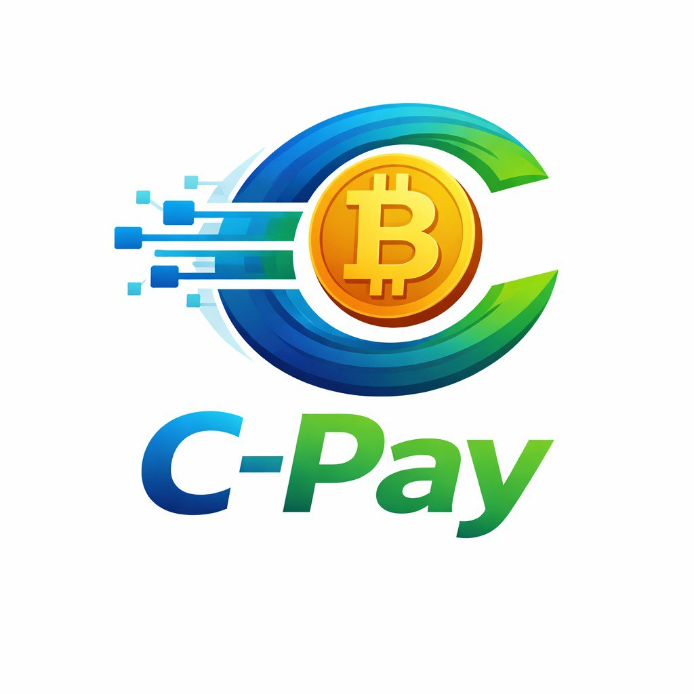

<div

# ⚡ CryptoPay - UPI for Web3

> Making blockchain payments as simple as scanning a QR code. No crypto knowledge required.

<div align="center">



</div>

[](https://reactnative.dev/)
[](https://expo.dev/)
[](https://soliditylang.org/)
[](https://polygon.technology/)
[](https://www.typescriptlang.org/)
[](LICENSE)

---

## 📋 Table of Contents

- [Overview](#-overview)
- [Download APK](#-download-apk)
- [Vision](#-vision)
- [Key Features](#-key-features)
- [Architecture](#-architecture)
- [Project Structure](#-project-structure)
- [Quick Start](#-quick-start)
- [Components](#-components)
- [Tech Stack](#-tech-stack)
- [How It Works](#-how-it-works)
- [Cost Breakdown](#-cost-breakdown)
- [Security](#-security)
- [Roadmap](#-roadmap)
- [Contributing](#-contributing)

---

## 🎯 Overview

**CryptoPay** is a mobile-first blockchain payment application that makes crypto transactions as simple as UPI. Users don't need to understand wallets, gas fees, or private keys — just scan a QR code, authenticate with PIN or biometrics, and pay instantly.

---

## 📱 Download APK

**Ready to try CryptoPay?** Download the latest Android APK:

🔗 **[Download CryptoPay APK](https://expo.dev/accounts/soumen0818/projects/cryptopay/builds/cd12dd8d-2765-4911-9d45-a7a6f5566d8d)**

> **Note:** This is a testnet version running on Polygon Amoy. Use test tokens only.

---

### What Makes CryptoPay Different?

| Traditional Crypto Wallets  | CryptoPay                             |
| --------------------------- | ------------------------------------- |
| 12-24 word seed phrases     | 6-digit PIN                           |
| Manual gas fee management   | Invisible to users (optional gasless) |
| Complex wallet addresses    | QR codes + phone numbers              |
| Separate merchant solutions | Built-in merchant mode                |
| Technical onboarding        | UPI-like simplicity                   |

---

## 💡 Vision

**Make blockchain payments invisible.**

Users shouldn't need to know they're using blockchain technology. Just like they don't think about HTTP when browsing the web, they shouldn't think about gas fees, nonces, or private keys when making payments.

### The UPI Analogy

Just as UPI revolutionized digital payments in India by abstracting banking complexity, CryptoPay abstracts blockchain complexity:

- ✅ **6-digit PIN** instead of mnemonic phrases
- ✅ **QR code payments** instead of copying addresses
- ✅ **Face ID / Fingerprint** instead of signing transactions manually
- ✅ **Instant settlement** (~2 seconds) instead of banking delays
- ✅ **No gas fee complexity** for end users
- ✅ **Merchant mode** built into the same app

---

## ✨ Key Features

### User Features

#### Authentication & Security

- 📱 **Phone Verification** - OTP-based authentication with rate limiting (3 attempts/24h)
- 🔐 **6-Digit PIN** - Simple, secure access (replaces complex mnemonics)
- 👆 **Biometric Auth** - Face ID / Touch ID unlock
- 🔑 **HD Wallet** - BIP-39/44 compliant wallet generation (invisible to user)
- 🛡️ **Encrypted Storage** - Private keys never leave device (SecureStore)

#### Payments

- 📸 **QR Code Scanning** - Scan merchant QR to pay instantly
- 💸 **Instant Transfers** - ~2 second settlement on Polygon
- 📊 **Transaction History** - Complete payment log with real-time updates
- 💰 **Balance Display** - PAY token balance with INR equivalent
- 🎁 **Testnet Faucet** - Claim 100 PAY tokens for testing (24h cooldown)
- 🔄 **Send Money** - Direct transfers to wallet addresses

#### User Experience

- 🎨 **Modern UI** - Clean, intuitive design with smooth animations
- 🌙 **Profile Management** - Customizable name and profile photo
- 🔄 **Change PIN** - Secure 3-step PIN update flow
- 🚪 **Session Management** - Sign out without losing wallet
- 🔓 **PIN Recovery** - Biometric + OTP verification flow
- 📴 **Offline-First** - Works without constant connectivity

### Merchant Features

- 🏪 **Merchant Registration** - Business name, category, location
- 📊 **Merchant Dashboard** - Sales analytics and payment insights
- 📱 **Global QR Code** - Reusable QR code for your business
- 💵 **Dynamic Pricing** - Generate QR codes with specific amounts
- 📈 **Transaction Tracking** - Real-time payment monitoring
- 🔔 **Payment Notifications** - Instant alerts for received payments
- 📋 **Payment History** - Detailed merchant transaction log

### Platform Features

- 🚀 **Gasless Transactions** (Optional) - Meta-transactions via relayer service
- ⚡ **Fast Settlement** - 2-second confirmation on Polygon Amoy
- 🌐 **Real-time Sync** - Supabase for instant updates
- 🔒 **Rate Limiting** - Anti-spam protection
- 📧 **Email Alerts** - Low balance notifications for relayer
- 🩺 **Health Monitoring** - Service uptime tracking

---

## 🏗️ Architecture

### System Overview

```
┌──────────────────────────────────────────────────────────────────────┐
│                         CRYPTOPAY ECOSYSTEM                          │
└──────────────────────────────────────────────────────────────────────┘

┌────────────────┐         ┌────────────────┐         ┌───────────────┐
│   Mobile App   │◄───────►│ Relayer Service│◄───────►│   Blockchain  │
│  (React Native)│         │   (Node.js)    │         │   (Polygon)   │
└────────┬───────┘         └────────────────┘         └───────┬───────┘
         │                                                     │
         │                                                     │
         │                 ┌────────────────┐                 │
         └────────────────►│    Supabase    │◄────────────────┘
                           │   (Database)   │
                           └────────────────┘
```

### Detailed Architecture

```
┌─────────────────────────────────────────────────────────────────────┐
│                          CLIENT LAYER                                │
│  ┌──────────────────────────────────────────────────────────────┐   │
│  │              React Native Mobile App (Expo)                   │   │
│  │  ┌──────────────┐  ┌──────────────┐  ┌──────────────────┐   │   │
│  │  │   Screens    │  │  Components  │  │    Navigation    │   │   │
│  │  │  (22 total)  │  │  (Reusable)  │  │   (Stack/Tab)    │   │   │
│  │  └──────────────┘  └──────────────┘  └──────────────────┘   │   │
│  │  ┌──────────────────────────────────────────────────────┐   │   │
│  │  │              Services Layer                           │   │   │
│  │  │  • Wallet Service (HD Wallet, PIN encryption)        │   │   │
│  │  │  • Blockchain Service (ethers.js v6)                 │   │   │
│  │  │  • Auth Service (OTP, rate limiting)                 │   │   │
│  │  │  • Supabase Service (DB, real-time)                  │   │   │
│  │  │  • Merchant Service (QR, analytics)                  │   │   │
│  │  │  • Relayer Service (meta-txs, optional)              │   │   │
│  │  └──────────────────────────────────────────────────────┘   │   │
│  │  ┌──────────────────────────────────────────────────────┐   │   │
│  │  │              Storage Layer                            │   │   │
│  │  │  • SecureStore (encrypted mnemonic, PIN hash)        │   │   │
│  │  │  • AsyncStorage (user prefs, cache)                  │   │   │
│  │  └──────────────────────────────────────────────────────┘   │   │
│  └──────────────────────────────────────────────────────────────┘   │
└─────────────────────────────────────────────────────────────────────┘
                                    │
                    ┌───────────────┴───────────────┐
                    │                               │
┌───────────────────▼─────────┐   ┌────────────────▼──────────────┐
│    BACKEND LAYER             │   │   BLOCKCHAIN LAYER            │
│  ┌─────────────────────────┐ │   │  ┌──────────────────────────┐│
│  │  Supabase (PostgreSQL)  │ │   │  │  Polygon Amoy Testnet    ││
│  │  • Users table          │ │   │  │  Chain ID: 80002         ││
│  │  • Transactions table   │ │   │  │  ┌─────────────────────┐ ││
│  │  • Merchants table      │ │   │  │  │  PayToken (ERC-20)  │ ││
│  │  • Real-time listeners  │ │   │  │  │  • transfer()       │ ││
│  │  • Storage (photos)     │ │   │  │  │  • balanceOf()      │ ││
│  └─────────────────────────┘ │   │  │  │  • faucet()         │ ││
│                               │   │  │  │  • Meta-txs support │ ││
│  ┌─────────────────────────┐ │   │  │  └─────────────────────┘ ││
│  │  Relayer Service        │ │   │  └──────────────────────────┘│
│  │  (Optional - Path B)    │ │   │                               │
│  │  • Express.js API       │◄┼───┤  RPC: https://rpc-amoy...    │
│  │  • Meta-tx execution    │ │   │  Explorer: amoy.polygonscan  │
│  │  • Signature verify     │ │   │                               │
│  │  • Gas subsidy          │ │   │                               │
│  │  • Rate limiting        │ │   │                               │
│  │  • Health checks        │ │   │                               │
│  └─────────────────────────┘ │   │                               │
└─────────────────────────────┘   └───────────────────────────────┘
```

### Data Flow Architecture

#### 1. Wallet Creation Flow

```
User Opens App (First Time)
        │
        ▼
Onboarding Screen (3 slides)
        │
        ▼
Phone Verification
  │
  ├─► Send OTP (Supabase Auth)
  ├─► Verify OTP (3 attempts/24h)
  └─► Create user record
        │
        ▼
Create 6-Digit PIN
        │
        ▼
Confirm PIN (Re-enter)
        │
        ▼
┌──────────────────────────────┐
│   WALLET GENERATION          │
│  ethers.Wallet.createRandom()│
│          │                   │
│          ▼                   │
│  ┌───────────────────┐       │
│  │ 12-word mnemonic  │       │
│  │ (BIP-39)          │       │
│  └────────┬──────────┘       │
│           │                  │
│           ▼                  │
│  ┌───────────────────┐       │
│  │ Derive HD Wallet  │       │
│  │ (BIP-44 path)     │       │
│  │ m/44'/60'/0'/0/0  │       │
│  └────────┬──────────┘       │
│           │                  │
│           ├─► Private Key    │
│           ├─► Public Key     │
│           └─► Address (0x...)│
└──────────────────────────────┘
        │
        ▼
┌──────────────────────────────┐
│   SECURE STORAGE             │
│  • Mnemonic → AES encrypt    │
│  •   with PIN as key         │
│  •   → SecureStore           │
│  • PIN → hash → SecureStore  │
│  • Address → AsyncStorage    │
└──────────────────────────────┘
        │
        ▼
Biometric Setup (Optional)
        │
        ▼
Profile Setup (Name, Photo)
        │
        ▼
Home Screen (Ready!)
```

#### 2. Payment Flow (Standard - Path A)

```
User Scans Merchant QR
        │
        ▼
QR Code Data:
{
  type: "payment",
  merchant: "0xMerchantAddress",
  amount: "10",
  reference: "ORDER123",
  merchantName: "Coffee Shop"
}
        │
        ▼
Payment Confirmation Screen
  • Merchant name: Coffee Shop
  • Amount: 10 PAY (₹100)
  • Your balance: 50 PAY
        │
        ▼
User Enters PIN (or Biometric)
        │
        ▼
┌──────────────────────────────┐
│   WALLET DECRYPTION          │
│  • Get encrypted mnemonic    │
│  • Decrypt with PIN          │
│  • Derive wallet instance    │
└──────────────────────────────┘
        │
        ▼
┌──────────────────────────────┐
│   BLOCKCHAIN TRANSACTION     │
│  const contract = new        │
│    ethers.Contract(...)      │
│  const tx = await            │
│    contract.transfer(        │
│      merchantAddress,        │
│      amount                  │
│    )                         │
│  await tx.wait()             │
└──────────────────────────────┘
        │
        ▼
Transaction Submitted
  • Hash: 0xabc123...
  • Status: Pending
        │
        ├─► Store in Supabase
        │   (transactions table)
        │
        └─► Poll for confirmation
                  │
                  ▼
            Confirmed! ✅
                  │
                  ├─► Update Supabase
                  │   (status: confirmed)
                  │
                  └─► Real-time update
                      to UI
                      │
                      ▼
              Success Animation
                "Payment Sent!"
```

#### 3. Payment Flow (Gasless - Path B)

```
User Scans Merchant QR
        │
        ▼
Payment Confirmation Screen
        │
        ▼
User Enters PIN (or Biometric)
        │
        ▼
┌──────────────────────────────┐
│   GET CURRENT NONCE          │
│  GET /nonce/:userAddress     │
│  ← { nonce: 5 }              │
└──────────────────────────────┘
        │
        ▼
┌──────────────────────────────┐
│   SIGN META-TRANSACTION      │
│  • Create EIP-712 message:   │
│    {                         │
│      from: userAddress,      │
│      to: merchantAddress,    │
│      amount: "10",           │
│      nonce: 5                │
│    }                         │
│  • wallet.signTypedData()    │
│  • Generate signature (0x...)│
└──────────────────────────────┘
        │
        ▼
┌──────────────────────────────┐
│   SUBMIT TO RELAYER          │
│  POST /relay                 │
│  {                           │
│    from, to, amount,         │
│    nonce, signature          │
│  }                           │
└──────────────────────────────┘
        │
        ▼
┌──────────────────────────────┐
│   RELAYER PROCESSING         │
│  1. Verify signature         │
│  2. Recover signer address   │
│  3. Check nonce matches      │
│  4. Check user balance       │
│  5. Submit to blockchain:    │
│     contract.executeMetaTx(  │
│       from, to, amount,      │
│       nonce, signature       │
│     ) {                      │
│       from: RELAYER_ADDRESS  │
│       // Relayer pays gas    │
│     }                        │
└──────────────────────────────┘
        │
        ▼
Transaction Hash Returned
  ← { txHash: "0xdef456..." }
        │
        ▼
Store in Supabase
  • User never paid gas
  • Platform subsidized
        │
        ▼
Poll for confirmation
        │
        ▼
Success! ✅
```

### Database Schema (Supabase)

```sql
-- Users Table
CREATE TABLE users (
  id UUID PRIMARY KEY DEFAULT uuid_generate_v4(),
  phone_number TEXT UNIQUE NOT NULL,
  wallet_address TEXT UNIQUE NOT NULL,
  name TEXT,
  profile_photo_url TEXT,
  is_merchant BOOLEAN DEFAULT FALSE,
  created_at TIMESTAMP DEFAULT NOW(),
  updated_at TIMESTAMP DEFAULT NOW()
);

-- Merchants Table
CREATE TABLE merchants (
  id UUID PRIMARY KEY DEFAULT uuid_generate_v4(),
  user_id UUID REFERENCES users(id) ON DELETE CASCADE,
  business_name TEXT NOT NULL,
  business_category TEXT,
  location TEXT,
  merchant_address TEXT UNIQUE NOT NULL,
  total_sales NUMERIC DEFAULT 0,
  transaction_count INTEGER DEFAULT 0,
  created_at TIMESTAMP DEFAULT NOW()
);

-- Transactions Table
CREATE TABLE transactions (
  id UUID PRIMARY KEY DEFAULT uuid_generate_v4(),
  from_address TEXT NOT NULL,
  to_address TEXT NOT NULL,
  amount NUMERIC NOT NULL,
  tx_hash TEXT UNIQUE NOT NULL,
  status TEXT NOT NULL, -- 'pending', 'confirmed', 'failed'
  type TEXT NOT NULL, -- 'send', 'receive', 'merchant_payment'
  block_number BIGINT,
  gas_used TEXT,
  merchant_name TEXT,
  note TEXT,
  created_at TIMESTAMP DEFAULT NOW(),
  confirmed_at TIMESTAMP
);

-- OTP Rate Limiting Table
CREATE TABLE otp_attempts (
  id UUID PRIMARY KEY DEFAULT uuid_generate_v4(),
  phone_number TEXT NOT NULL,
  attempt_count INTEGER DEFAULT 1,
  first_attempt_at TIMESTAMP DEFAULT NOW(),
  last_attempt_at TIMESTAMP DEFAULT NOW()
);

-- Indexes for performance
CREATE INDEX idx_users_wallet ON users(wallet_address);
CREATE INDEX idx_users_phone ON users(phone_number);
CREATE INDEX idx_transactions_from ON transactions(from_address);
CREATE INDEX idx_transactions_to ON transactions(to_address);
CREATE INDEX idx_transactions_status ON transactions(status);
CREATE INDEX idx_transactions_created ON transactions(created_at DESC);
```

---

## 📁 Project Structure

```
CryptoPay/
│
├── App/                          # React Native Mobile Application
│   ├── src/
│   │   ├── screens/             # UI Screens (22 screens)
│   │   ├── components/          # Reusable Components
│   │   ├── services/            # Business Logic
│   │   ├── utils/               # Helper Functions
│   │   ├── types/               # TypeScript Definitions
│   │   ├── constants/           # Configuration
│   │   └── navigation/          # Navigation Setup
│   ├── assets/                  # Static Assets
│   ├── docs/                    # Documentation (15+ files)
│   ├── Database-schema/         # SQL Migrations
│   ├── App.tsx
│   ├── package.json
│   └── README.md                # App-specific documentation
│
├── Blockchain/                   # Smart Contracts
│   ├── contracts/
│   │   └── PayToken.sol         # ERC-20 Token + Meta-txs
│   ├── scripts/
│   │   └── deploy.js            # Deployment Script
│   ├── test/
│   │   └── PayToken.test.js     # Contract Tests
│   ├── hardhat.config.js
│   ├── package.json
│   └── README.md                # Blockchain-specific documentation
│
├── relayer-service/              # Backend Service (Optional)
│   ├── server.js                # Express API
│   ├── package.json
│   └── README.md                # Relayer-specific documentation
│
└── README.md                     # This File (Global Overview)
```

---

## 🚀 Quick Start

### Prerequisites

- **Node.js** >= 18.0.0
- **npm** >= 9.0.0
- **Expo Go app** on your mobile device
- **Supabase account** (free tier)
- **MetaMask** or similar wallet (for deployment)

### 1. Clone Repository

```bash
git clone https://github.com/yourusername/CryptoPay.git
cd CryptoPay
```

### 2. Setup Mobile App

```bash
cd App
npm install

# Create environment file
cp .env.example .env
```

Edit `App/.env`:

```env
EXPO_PUBLIC_SUPABASE_URL=https://your-project.supabase.co
EXPO_PUBLIC_SUPABASE_ANON_KEY=your-anon-key
EXPO_PUBLIC_TOKEN_ADDRESS=0xYourTokenAddress
EXPO_PUBLIC_RPC_URL=https://rpc-amoy.polygon.technology
EXPO_PUBLIC_CHAIN_ID=80002
```

### 3. Deploy Smart Contract

```bash
cd ../Blockchain
npm install

# Create environment file
cp .env.example .env
```

Edit `Blockchain/.env`:

```env
PRIVATE_KEY=your_wallet_private_key
AMOY_RPC_URL=https://rpc-amoy.polygon.technology
RELAYER_ADDRESS=0xYourRelayerAddress
```

Get test MATIC from [https://faucet.polygon.technology/](https://faucet.polygon.technology/), then deploy:

```bash
npx hardhat run scripts/deploy.js --network amoy
```

Copy the deployed token address to `App/.env`.

### 4. (Optional) Setup Relayer Service

```bash
cd ../relayer-service
npm install
cp .env.example .env
```

Edit `relayer-service/.env` with your configuration, fund relayer wallet with MATIC, then:

```bash
npm start
```

Update `App/.env` with relayer URL.

### 5. Run Mobile App

```bash
cd ../App
npm start
```

Scan QR code with Expo Go app on your phone!

---

## 🧩 Components

### Mobile App (`App/`)

**Purpose:** Cross-platform mobile application for iOS and Android

**Key Features:**

- User authentication (phone OTP, PIN, biometrics)
- Wallet creation and management
- QR code scanning and generation
- Payment processing
- Transaction history
- Merchant mode

**Technologies:** React Native, Expo, TypeScript, Ethers.js v6

📖 **[Detailed App Documentation](App/README.md)**

---

### Smart Contracts (`Blockchain/`)

**Purpose:** On-chain logic for token transfers and meta-transactions

**Key Contract:** PayToken (ERC-20 + EIP-2771)

**Features:**

- Standard ERC-20 functionality
- Faucet (100 PAY / 24h for testing)
- Meta-transaction support
- Nonce management
- Relayer authorization

**Network:** Polygon Amoy Testnet (Chain ID: 80002)

📖 **[Detailed Blockchain Documentation](Blockchain/README.md)**

---

### Relayer Service (`relayer-service/`)

**Purpose:** Backend service for gasless transactions (Optional - Path B)

**Key Features:**

- Accept signed meta-transactions
- Verify signatures (EIP-712)
- Submit transactions to blockchain
- Pay gas fees on behalf of users
- Monitor service health

**Technologies:** Node.js, Express, Ethers.js v6

📖 **[Detailed Relayer Documentation](relayer-service/README.md)**

---

## 🛠 Tech Stack

### Frontend (Mobile App)

| Technology           | Version | Purpose                              |
| -------------------- | ------- | ------------------------------------ |
| **React Native**     | 0.81    | Cross-platform mobile framework      |
| **Expo**             | ~54.0   | Build tooling and managed workflow   |
| **TypeScript**       | ~5.9    | Type safety and developer experience |
| **Ethers.js**        | v6.16   | Ethereum/Polygon interactions        |
| **React Navigation** | v7      | Stack and tab navigation             |
| **Supabase JS**      | v2.89   | Database client and real-time        |
| **Expo SecureStore** | Latest  | Encrypted key storage                |
| **Expo Local Auth**  | Latest  | Biometric authentication             |
| **Expo Camera**      | Latest  | QR code scanning                     |
| **React Native SVG** | Latest  | QR code generation                   |

### Backend

| Service               | Purpose                                                    | Cost                             |
| --------------------- | ---------------------------------------------------------- | -------------------------------- |
| **Supabase**          | PostgreSQL database, real-time subscriptions, file storage | Free tier ($0-$25/mo)            |
| **Node.js + Express** | Relayer service API (optional)                             | Self-hosted or cloud ($0-$10/mo) |

### Blockchain

| Technology          | Purpose                                     |
| ------------------- | ------------------------------------------- |
| **Solidity 0.8.20** | Smart contract language                     |
| **Hardhat**         | Development environment, testing framework  |
| **OpenZeppelin**    | Secure contract libraries (ERC-20, Ownable) |
| **Polygon Amoy**    | Layer 2 testnet (fast, cheap transactions)  |
| **Ethers.js v6**    | Blockchain interaction library              |

---

## ⚙️ How It Works

### User Journey: First-Time User

```
1. Download App
   ↓
2. Phone Verification (OTP)
   ↓
3. Create 6-Digit PIN
   ↓
4. [Automatic] Wallet Created (invisible to user)
   ↓
5. Enable Biometrics (optional)
   ↓
6. Setup Profile (name, photo)
   ↓
7. Claim Faucet (100 PAY tokens)
   ↓
8. Ready to Pay!
```

### User Journey: Making a Payment

```
1. Tap "Scan & Pay"
   ↓
2. Scan Merchant QR Code
   ↓
3. Review Payment Details
   - Merchant: Coffee Shop
   - Amount: 10 PAY (₹100)
   ↓
4. Enter PIN or Use Face ID
   ↓
5. [Background] Sign Transaction
   ↓
6. [Background] Submit to Blockchain
   ↓
7. Success! Payment Sent ✅
   (Takes ~2 seconds)
```

### Merchant Journey

```
1. Enable Merchant Mode
   ↓
2. Register Business
   - Name, Category, Location
   ↓
3. Generate Global QR Code
   ↓
4. Display QR at Store
   ↓
5. Customer Scans & Pays
   ↓
6. Instant Notification
   ↓
7. View in Dashboard
```

---

## 💰 Cost Breakdown

### MVP Development (Current)

| Component            | Cost         | Notes                             |
| -------------------- | ------------ | --------------------------------- |
| **Development**      | $0           | Self-developed                    |
| **Supabase**         | $0           | Free tier (500MB DB, 1GB storage) |
| **Polygon Amoy**     | $0           | Testnet (no real MATIC costs)     |
| **Expo Development** | $0           | Free tier                         |
| **GitHub**           | $0           | Public repository                 |
| **Total**            | **$0/month** | ✅ Completely free!               |

### Production Deployment (Estimated)

| Component                       | Cost              | Notes                                 |
| ------------------------------- | ----------------- | ------------------------------------- |
| **Supabase Pro**                | $25/mo            | More storage, better performance      |
| **Relayer Service**             | $5-10/mo          | Render/Railway free tier or cheap VPS |
| **Domain**                      | $12/year          | Optional                              |
| **Expo EAS**                    | $29/mo            | Production builds, updates            |
| **SMS Gateway**                 | $0.01-0.05/SMS    | Twilio/AWS SNS for real OTP           |
| **Gas Fees (if using relayer)** | Variable          | ~$0.01/tx on Polygon mainnet          |
| **Polygon Mainnet RPC**         | $0-49/mo          | Alchemy/Infura (free tier available)  |
| **Total**                       | **~$60-75/month** | + variable gas costs                  |

### Cost Per Transaction

| Scenario              | User Cost                  | Platform Cost          |
| --------------------- | -------------------------- | ---------------------- |
| **Standard (Path A)** | ~$0.001 MATIC (negligible) | $0                     |
| **Gasless (Path B)**  | $0                         | ~$0.01 per transaction |

---

## 🔒 Security

### Wallet Security

- **HD Wallet Generation:** BIP-39/44 compliant, industry standard
- **Encrypted Storage:** Mnemonic encrypted with AES-256 before storing
- **SecureStore:** OS-level encrypted storage (Keychain on iOS, Keystore on Android)
- **PIN Protection:** 6-digit PIN required for all sensitive operations
- **Biometric Lock:** Face ID / Touch ID as alternative to PIN
- **No Exposure:** Private keys NEVER leave device or shown to user

### Authentication Security

- **Rate Limiting:** 3 OTP attempts per 24 hours per phone number
- **Session Management:** Secure token-based sessions
- **PIN Hashing:** One-way hash stored (cannot reverse-engineer PIN)
- **Biometric Fallback:** Device credential required if biometrics unavailable

### Network Security

- **HTTPS Only:** All API calls over HTTPS
- **CORS Protection:** Relayer service restricts origins
- **Rate Limiting:** API endpoints protected from abuse (100 req/min)
- **Helmet.js:** Security headers (XSS, clickjacking protection)
- **Input Validation:** All inputs sanitized and validated

### Smart Contract Security

- **OpenZeppelin:** Using audited, battle-tested contract libraries
- **Access Control:** Owner-only functions for sensitive operations
- **Nonce System:** Prevents replay attacks in meta-transactions
- **Signature Verification:** Cryptographic proof of authorization
- **Tested:** Comprehensive test suite (25+ tests)

---

## 🛣 Roadmap

### ✅ Phase 1: MVP (Completed - January 2026)

**Goal:** Functional testnet application with core features

- [x] User authentication (phone OTP, PIN, biometrics)
- [x] HD wallet creation and management
- [x] QR code payments
- [x] Transaction history
- [x] Merchant mode with dashboard
- [x] Faucet integration
- [x] Supabase backend integration
- [x] Smart contract deployment
- [x] Gasless transaction support (relayer service)
- [x] Profile management
- [x] PIN change flow
- [x] APK build configuration

**Status:** 🎉 **COMPLETE**

---

### 🚧 Phase 2: Production Ready (Q1 2026)

**Goal:** Mainnet deployment with production-grade features

**Blockchain:**

- [ ] Deploy PayToken on Polygon mainnet
- [ ] Smart contract audit (CertiK/OpenZeppelin)
- [ ] Upgrade to UUPS upgradeable pattern
- [ ] Multi-token support (USDC, DAI)

**Backend:**

- [ ] Real OTP service (Twilio/AWS SNS)
- [ ] Push notifications (Firebase Cloud Messaging)
- [ ] Advanced rate limiting per user
- [ ] Merchant API for third-party integrations
- [ ] Admin dashboard for monitoring

**Mobile App:**

- [ ] App Store submission (iOS)
- [ ] Google Play Store submission (Android)
- [ ] Deep linking support
- [ ] Share payment links
- [ ] Payment requests
- [ ] Recurring payments
- [ ] Multi-language support (Hindi, English)

**Security:**

- [ ] Social recovery (3-of-5 guardians)
- [ ] Transaction spending limits
- [ ] Fraud detection
- [ ] Bug bounty program

---

### 🔮 Phase 3: Scale & Enhance (Q2-Q3 2026)

**Goal:** Advanced features and ecosystem growth

- [ ] Fiat on/off ramp (Transak, Wyre)
- [ ] Cross-chain payments (Polygon → Ethereum)
- [ ] Payment splitting (split bill feature)
- [ ] Scheduled payments
- [ ] Invoice generation
- [ ] Merchant analytics dashboard
- [ ] Rewards/cashback system
- [ ] Referral program
- [ ] White-label solution for businesses
- [ ] Web version (React)

---

## 🤝 Contributing

We welcome contributions! Whether you're fixing bugs, improving documentation, or adding new features, your help is appreciated.

### How to Contribute

1. Fork the repository
2. Create feature branch (`git checkout -b feature/amazing-feature`)
3. Make your changes
4. Commit changes (`git commit -m 'Add amazing feature'`)
5. Push to branch (`git push origin feature/amazing-feature`)
6. Open Pull Request

### Code Style

- **TypeScript:** Use strict mode, define types
- **React:** Functional components, hooks
- **Solidity:** Follow OpenZeppelin standards
- **Naming:** camelCase for variables, PascalCase for components

---

## 📄 License

MIT License - Feel free to use this project for learning, building, or commercial purposes!

---

## 🙏 Acknowledgments

- **React Native & Expo** - Amazing mobile development experience
- **Ethers.js** - Robust Web3 library
- **OpenZeppelin** - Secure smart contract standards
- **Supabase** - Generous free tier and great DX
- **Polygon** - Fast, cheap testnet infrastructure

---

<div align="center">

## 🎯 Project Status

| Component       | Status                | Version |
| --------------- | --------------------- | ------- |
| Mobile App      | ✅ Production Ready   | v1.0.0  |
| Smart Contracts | ✅ Deployed (Testnet) | v1.0.0  |
| Relayer Service | ✅ Optional (Working) | v1.0.0  |
| Documentation   | ✅ Complete           | -       |

### Quick Stats

💰 **Budget:** $0  
⏱️ **Timeline:** 6 weeks  
📱 **Screens:** 22  
🧪 **Tests:** 25+  
⭐ **Features:** 30+

---

### **Status: READY FOR TESTNET USERS**

_Last Updated: January 11, 2026_

---

**Built with constraints, shipped with confidence.**

Made with ❤️ for the Web3 community

</div>
